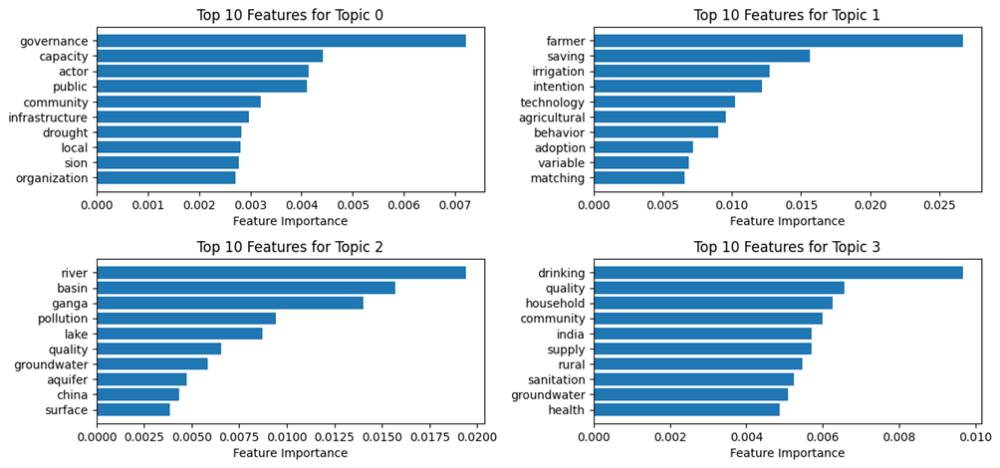
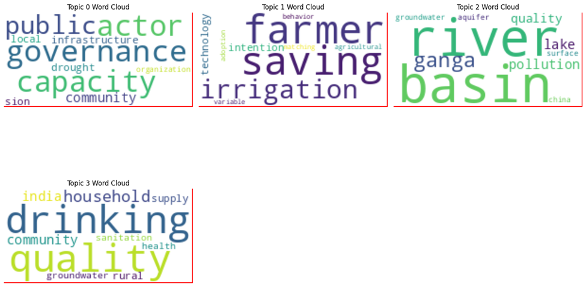

# Topic Modelling on Water Policy Articles
This project aims to apply topic modeling algorithms to a collection of 50 articles focused on water policy. The articles have been attached as .zip file below.
By analyzing these texts, we seek to identify predominant themes, such as regulatory frameworks, conservation strategies, and stakeholder roles, that inform the current water policy landscape. The findings can provide valuable insights for policymakers and researchers to better understand the priorities, challenges, and emerging trends in water policy, supporting more informed and impactful policy development.
## Topic Modelling Algorithms explored
#### •	Non-Negative Matrix Factorization (NMF),
#### •	Latent Dirichlet Allocation (LDA), 
#### •	Latent Semantic Analysis (LSA) 

## Best Model for Analysis:
## NFM Model with Coherence Score of 0.62
Topic 0: governance, capacity, actor, public, community, infrastructure, drought, local, sion, organization
Topic 1: farmer, saving, irrigation, intention, technology, agricultural, behavior, adoption, variable, matching
Topic 2: river, basin, ganga, pollution, lake, quality, groundwater, aquifer, china, surface
Topic 3: drinking, quality, household, community, india, supply, rural, sanitation, groundwater, health

### Top 10 words

## INFERENCE AND RECOMMENDATIONS:
1.	Topic 0: Governance and Infrastructure
o	Keywords: governance, capacity, actor, public, community, infrastructure, drought, local, organization
o	Inference: This topic highlights the role of governance and infrastructure in water policy, focusing on community engagement and organizational capacity to address local issues like drought and water distribution. This theme suggests a need for structured governance models that empower local actors and enhance infrastructure resilience.
o	Business Implications:
 Policy Development: Policymakers and municipal governments can leverage these insights to establish frameworks that improve community participation and optimize resource allocation for drought-prone areas.
 Infrastructure Investment: Private sector firms specializing in water technology could explore partnerships with public agencies to develop drought-resistant infrastructure, creating market opportunities while contributing to sustainability goals.
 Organizational Capacity Building: NGOs and community-based organizations can use these findings to advocate for greater local involvement and tailored solutions, which may lead to funding or support from stakeholders focused on social responsibility.
2.	Topic 1: Agriculture and Technology Adoption
o	Keywords: farmer, saving, irrigation, intention, technology, agricultural, behavior, adoption, variable, matching
o	Inference: This topic centers around agricultural water usage, particularly the adoption of water-saving technologies and irrigation practices among farmers. The focus on behavioral intention and adoption indicates both challenges and opportunities in driving technology use in agriculture.
o	Business Implications:
 Agri-Tech Solutions: Companies developing water-efficient agricultural technologies can target education and training initiatives to increase adoption rates among farmers, thereby reducing water usage and enhancing productivity.
	Behavioral Research and Incentives: Governments and NGOs could collaborate with behavioral scientists to design programs that incentivize farmers to adopt sustainable irrigation practices, contributing to more efficient water resource use.
	Product Development and Customization: Insights from this topic can guide agri-tech firms in tailoring their products to meet regional needs, particularly in areas where water conservation is critical.
3.	Topic 2: River Basins and Water Quality Management
o	Keywords: river, basin, ganga, pollution, lake, quality, groundwater, aquifer, china, surface
o	Inference: This topic deals with water quality concerns, specifically pollution in river basins and aquifers. It brings attention to contamination issues impacting major water bodies and the quality of groundwater resources.
o	Business Implications:
	Pollution Control Initiatives: Environmental agencies and water utilities can use these insights to prioritize areas for pollution control, specifically targeting river basins that support large populations or industrial activity.
	Investment in Clean Water Technologies: The private sector can explore business opportunities in water purification and pollution monitoring, creating solutions that mitigate contamination in critical water sources.
	Cross-border Collaboration: For transboundary water bodies, governments may find value in cross-border collaborations to address shared pollution challenges, potentially leading to joint investment in conservation initiatives.
4.	Topic 3: Drinking Water Quality and Public Health
o	Keywords: drinking, quality, household, community, india, supply, rural, sanitation, groundwater, health
o	Inference: This topic emphasizes the relationship between drinking water quality, sanitation, and public health, particularly in rural and community contexts. It underscores the ongoing need for safe water access and sanitation, linking directly to public health outcomes.
o	Business Implications:
	Healthcare Sector Integration: Public health agencies can use these insights to develop health campaigns that educate communities on safe water practices, reducing water-borne diseases and improving overall health outcomes.
	Rural Sanitation Solutions: Businesses specializing in sanitation infrastructure could expand their services in rural areas, creating scalable solutions that support water quality and hygiene.
	Corporate Social Responsibility (CSR): Corporations can invest in clean water initiatives as part of their CSR efforts, targeting rural communities with improved access to safe drinking water, which can enhance their social impact.
